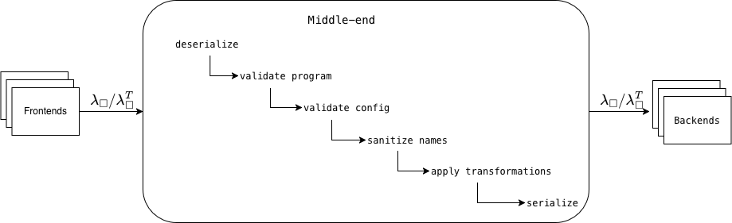
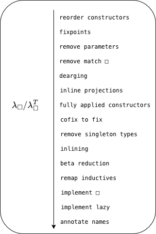

# Peregrine Middle-end

The middle-end connects frontends and backends and serves three purposes:

1) Defines a common IR and configuration format and is responsible for converting to the formats expected by the backends
   
   For more details on IR and configuration format see [format.md](format.md).

2) Validates and ensure $\lambda_\square$ and frontend/backend configuration is compatible
3) Lower $\lambda_\square$ to the necessary subset compatible with the backends, and apply common program transformations and optimizations

This document details points 2 and 3 and shows the general middle-end pipeline.
For more details on frontends and backends, see [frontends.md](frontends.md), [backends.md](backends.md).

The middle-end is exposed as a CLI, for more details on how to use the middle-end, see [cmds.md](cmds.md)

## Pipeline

### Serialization/Deserialization
The first step in the pipeline is deserializing the input program and optionally configuration file if provided.
This step is fully verified.
The serialization/deserialization is implemented in [theories/serialization](/theories/serialization/).

### Validate program
Next step is validating that the program is wellformed. This check is implemented in [theories/CheckWf.v](/theories/CheckWf.v) and is verified.
This step checks:
1) that the environment doesn't contain undefined global declarations or inductive declarations
2) environment sorted topologically
3) that the program is closed
4) doesn't use block representation of constructors
5) cases are exhaustive
6) that the program doesn't contain any language constructs not supported

### Validate config
This step validates the options provided by the user and determines the final values that will be used for all options.
The final options used will depend on the user provided configuration, whether the input is typed, and which backend is being targeted. The middle-end ensures that the final options are compatible with the backend.

By default, all option fields are optional in the configuration file format. Any option left unspecified in the provided configuration object will be filled with the default value for the chosen backend.

Validation does the following:
1) Fill undeclared option with default values
2) Check that options are compatible with the backend
3) Check that AST type and backend are compatible
4) Determine which transformations to apply based on configurations, and whether a transformations is required or incompatible with the chosen backend.
5) Validate configuration values 

If the configuration is invalid the pipeline either fails or prints a warning and ignores the invalid options.

### Sanitize identifiers
Some frontends have fewer restrictions on valid identifier names than the backends, thus a name sanitization pass is performed if necessary based on the target backend.

### Apply transformations
The transformations that will be applied will depend on both the AST type, backend, and user configuration. See support matrix below for more details.

* **reorder constructors**:
  a pass which reorder constructor in the inductive definition. This is useful when the trying to remap types to native types in the target language and the constructor order is different.
* **fixpoints**:
  a pass which changes the semantics of recursive functions to always unfold
* **remove parameters**:
  a pass which removes parameters of inductive types, because they cannot play a computational role
* **remove match $\square$**:
  a pass that removes the rule that case analysis on $\square$ is permitted by locally reducing them away
* **dearging**:
  Remove dead arguments
* **inline projections**:
  a pass replacing primitive projections by case analysis
* **fully applied constructors**:
  a pass inlining constructor arguments via application into the arguments carried by the constructors, i.e. constructors cannot be partially applied anymore
* **cofix to fix**:
  a pass which implements cofix with fix and lazy
* **remove singleton types**:
  Unboxes singleton types by, i.e. inductive types with 1 constructor with 1 argument 
* **inlining**:
  a pass inlining declarations. Only declarations declared as inline will be inlined.
* **beta reduction**:
  a pass performing beta reduction
* **remap inductives**:
  a pass for remapping of inductive declaratiuons. Constructors and eliminator are remapped to axioms, which can be further remapped using the global declaration remapping feature.
* **implement $\square$**:
  a pass replacing $\square$ by an explicit recursive function ignoring its argument
* **implement lazy**:
  a pass replacing lazy/force 
* **annotate names**:
  a pass replacing de Bruijn variables by names

### Transformation support (Untyped target AST)

| Pass                       | C   | Wasm | OCaml | CakeML | Eval | AST |
|----------------------------|---------------|---------------|-----|------|-------|--------|
| reorder constructors       | optional, default on | optional, default on | optional, default on | optional, default on | optional, default on | optional, default on |
| fixpoints                  | required | required | required | required | required | required |
| remove parameters          | required | required | required | required | required | required |
| remove match $\square$     | required | required | required | required | required | required |
| dearging                   | optional, default on (requires typed) | optional, default on (requires typed) | optional, default on (requires typed) | optional, default on (requires typed) | optional, default on (requires typed) | optional, default on (requires typed) |
| inline projections         | required | required | required | required | required | required |
| fully applied constructors | required | required | required | required | required | required |
| cofix to fix               | optional, default off | optional, default off | optional, default off | optional, default off | optional, default off | optional, default off |
| remove singleton types     | optional, default off | optional, default off | optional, default off | optional, default off | optional, default off | optional, default off |
| inlining                   | optional, default on | optional, default on | optional, default on | optional, default on | optional, default on | optional, default on |
| beta reduction             | optional, default off | optional, default off | optional, default off | optional, default off | optional, default off | optional, default off |
| remap inductives           | optional, default on | optional, default on | optional, default on | optional, default on | optional, default on | optional, default on |
| implement $\square$        | required | required | required | required | required | optional, default off |
| implement lazy             | optional, default off | optional, default off | optional, default off | optional, default off | optional, default off | optional, default off |
| annotate names             | optional, default off | optional, default off | required | required | optional, default off | optional, default off |

### Transformation support (Typed target AST)

| Pass                       | Rust                 | Elm                  | AST                   |
|----------------------------|----------------------|----------------------|-----------------------|
| remove parameters          | required             | required             | required              |
| dearging                   | optional, default on | optional, default on | optional, default off |
